# Entry-Management-Software
### Entry Management Software: Innovaccer

### Introduction
**Entry Management Software**  (**EMS**) is a completely local host (phpMyAdmin) based application for the assignment of Innovaccer.
It is a software to automate the process of Entry management system in Innovaccer.

### Tools and Technology Used:
 - HTML
 - CSS
 - Bootstrap
 - Javascript/JQuery
 - PHP (sessions)
 - MySQL
 - Web Security(SQL Injection)
 
 ## Description
 The approach towards this assignment is to automate the task of EMS. By using one of the major concept of Software Engineering: **Sequential Diagram** to easily visualize this system.

 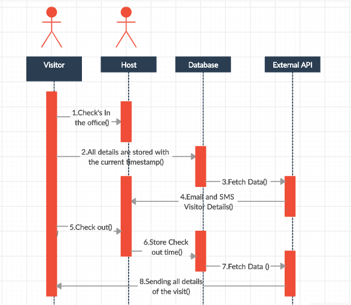
 
 **index.php** is the landing page for the whole application in src folder. **css** folder contains all the css style sheets for the application. **img** folder contains all the images of the application.
 
 ## Flow of the application
 ### Landing pages of the application
 #### index.php
 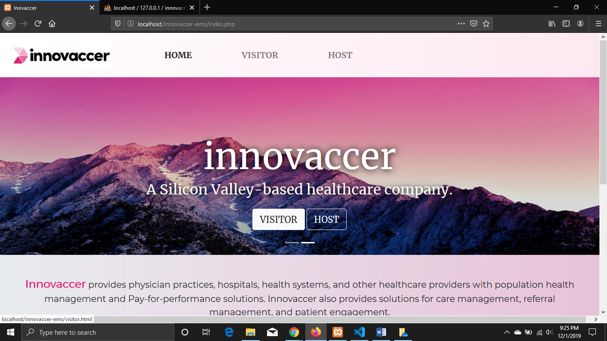
 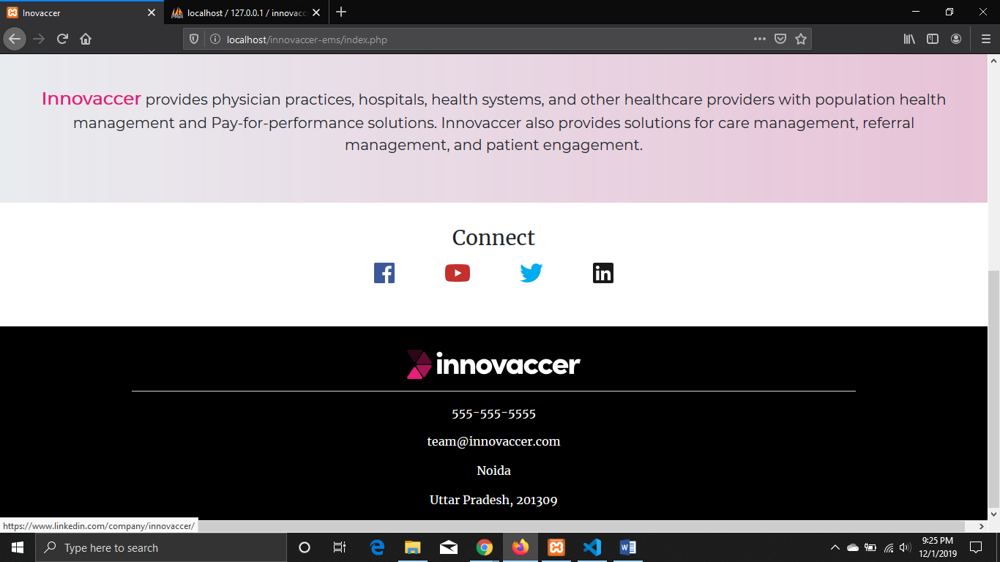
 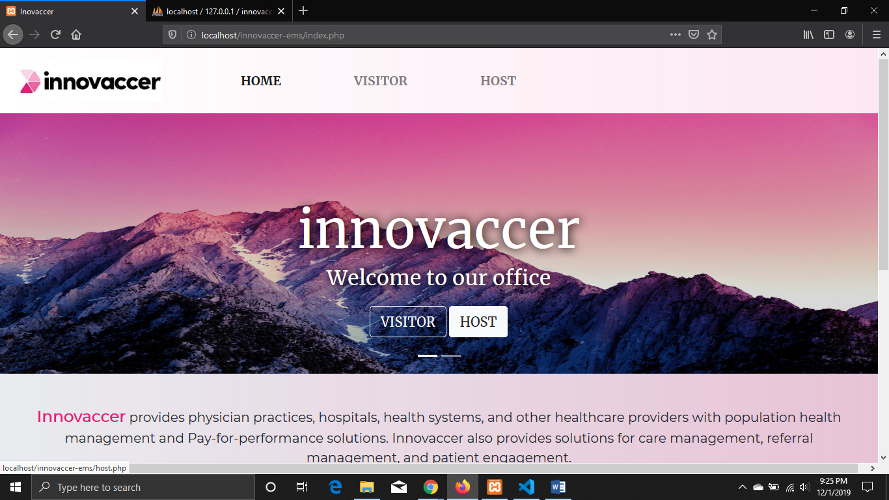
 
 #### host.php
 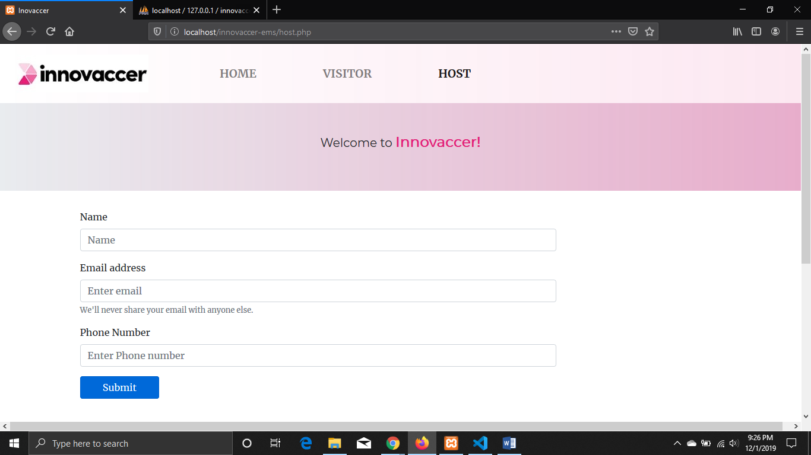
 
 #### visitor.php
 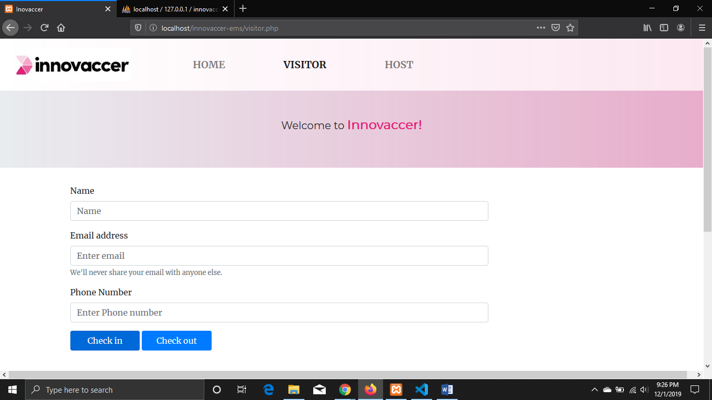
 
 ## Control flow
 #### step 1
 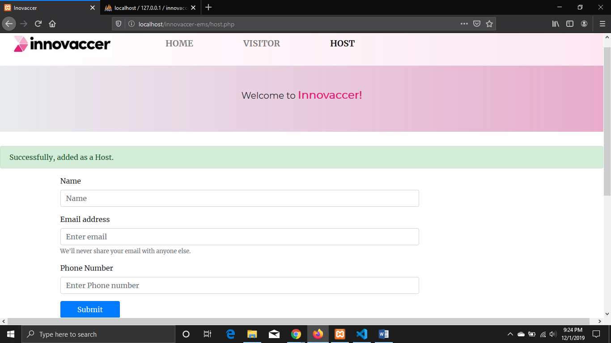
 
 #### step 2
 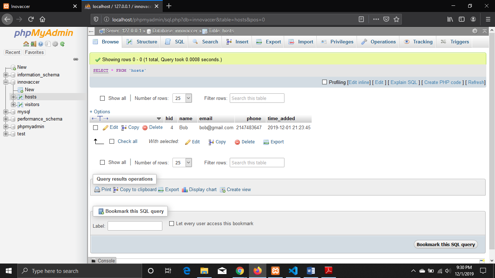
 
 #### step 3
 
 
 #### step 4
 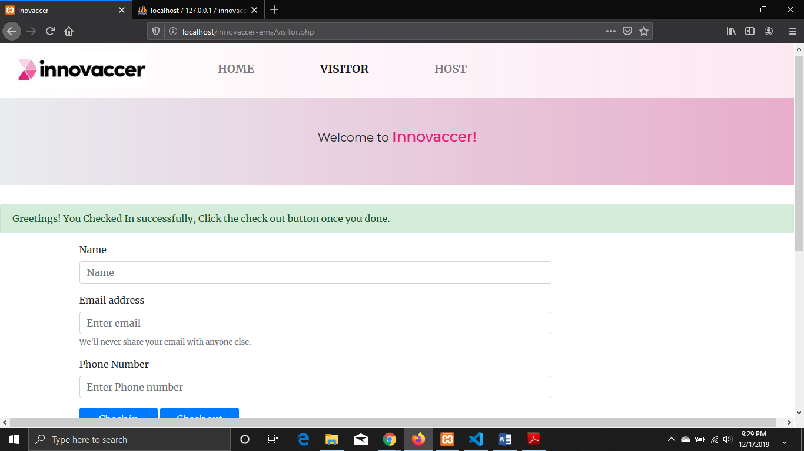
 
 ### After this step Host will receive all the details of visitor.
 
 #### Email: Using localhost mail() function and SMS through <a href="https://g.co/kgs/gdPYLd">Textlocal</a> (Note: This API provides only 10 SMS for free.) written in PHP script.
 
 #### Important for mail() using localhost Xampp:
 
 #### Make changes in php.ini file in xampp folder of C drive:
SMTP=smtp.gmail.com
smtp_port=587
sendmail_from = mail@gmail.com
sendmail_path = "\"C:\xampp\sendmail\sendmail.exe\" -t"

 #### Make changes in sendmail.ini file in xampp folder of C drive:
smtp_server=smtp.gmail.com
smtp_port=587
error_logfile=error.log
debug_logfile=debug.log
auth_username=mail@gmail.com
auth_password=yourpassword
force_sender=mail@gmail.com
 
 #### step 5
 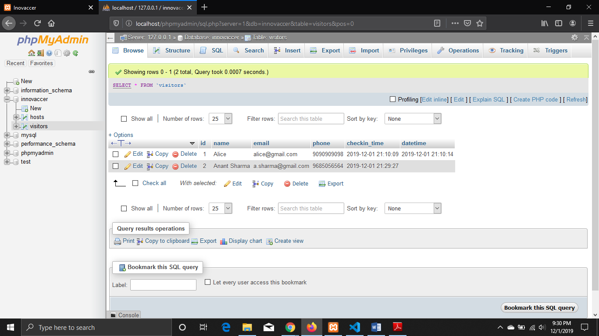
 
 #### step 6
 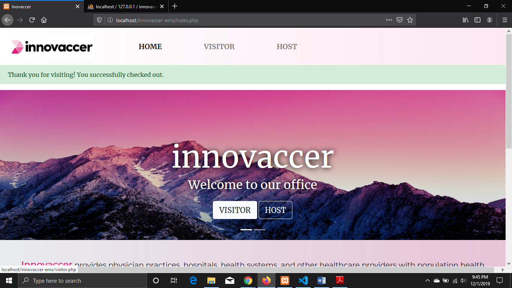
 
 ### After this step when visitor clicks check out button.
 
 #### step 7
 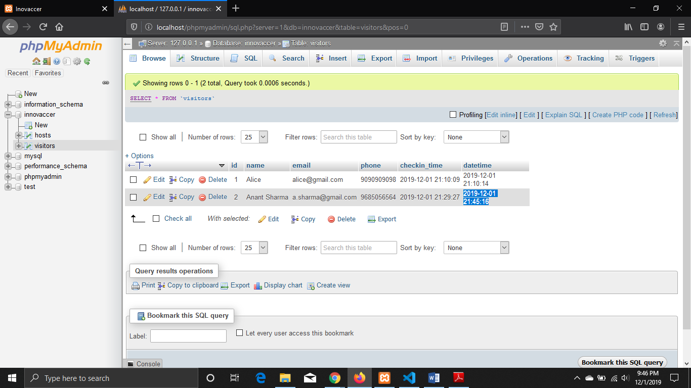
 
 ### After this, Visitor will receive all the visit details as mentioned in the above MySQL Database. Checkin_time and checkout_time(datetime) in the above picture also.
 
 ## End of file.
 
 ### Thanks for giving this opportunity, Hope for a good news soon :blush: .
